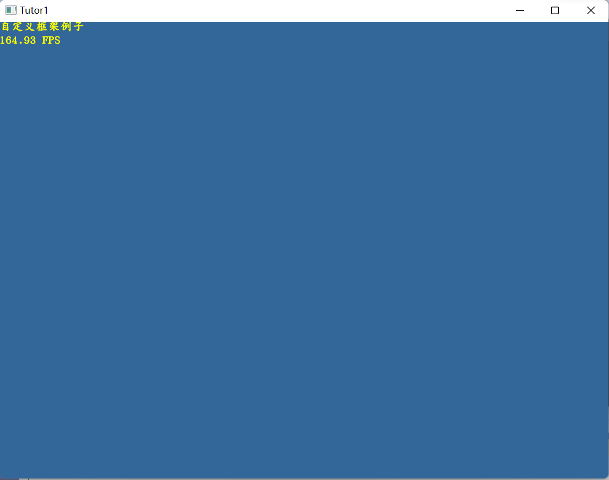

# 002-Tutor1

**万事开头第一步，写个demo来充数。**

应用程序框架，都继承自App3DFramework基类，该类实在Engine_Core/App Layer中定义。主要针对不同os平台进行分装，提供统一显示框架。

派生自己的运行app，需要重写：

```cpp
virtual void OnCreate()；
virtual void OnDestroy()；
virtual void OnSuspend()；
virtual void OnResume()；
virtual void DoUpdateOverlay();
virtual KlayGE::uint32_t DoUpdate(KlayGE::uint32_t pass);

```

**App3DFramework支持多个平台运行：**

- windows desktop
- windows store
- linux
- android
- ios/Darwin

**Demo start**

老的wiki写的例子，发现竟然是熟悉的Array[osg大神]，再次膜拜。只不过文档好久没更新了，和代码中的有些不一致，稍做调整，写个cmake工程练手。

TutorFramework.h

```cpp
// http://www.klayge.org/wiki/index.php/Tutor1_-_%E6%9E%84%E5%BB%BA%E8%87%AA%E5%B7%B1%E7%9A%84%E5%BA%94%E7%94%A8%E7%A8%8B%E5%BA%8F%E6%A1%86%E6%9E%B6
#include <KlayGE/KlayGE.hpp>
#include <KlayGE/App3D.hpp>
#include <KlayGE/ResLoader.hpp>
#include <KlayGE/Context.hpp>
#include <KlayGE/Font.hpp>
#include <KlayGE/RenderEngine.hpp>
#include <KlayGE/RenderFactory.hpp>
#include <KlayGE/FrameBuffer.hpp>
#include <KlayGE/UI.hpp>

#include <vector>
#include <sstream>

class TutorFramework : public KlayGE::App3DFramework
{
public:
	TutorFramework();
protected:
	//virtual void InitObjects();
	virtual void OnCreate();
private:
	virtual void DoUpdateOverlay();
	virtual KlayGE::uint32_t DoUpdate(KlayGE::uint32_t pass);
	
	KlayGE::FontPtr font_;
};

```

TutorFramework.cpp

```cpp
#include "TutorFramework.h"

TutorFramework::TutorFramework()
    : App3DFramework("Tutor1")
{
}

void TutorFramework::OnCreate()
{
    font_ = KlayGE::SyncLoadFont("gkai00mp.kfont");
}

void TutorFramework::DoUpdateOverlay()
{
    // 将当前的FPS信息输出到字符串中，以备渲染到屏幕上
    std::wostringstream stream;
    stream.precision(2);
    stream << std::fixed << this->FPS() << " FPS";

    // 使用之前构建的新字体来渲染文本信息，RenderText()可以接受的参数包括：
    // X，Y位置，KlayGE::Color颜色，std::wstring类型的字符串，以及字体大小
    font_->RenderText(0, 0, KlayGE::Color(1, 1, 0, 1), L"自定义框架例子", 16);
    font_->RenderText(0, 18, KlayGE::Color(1, 1, 0, 1), stream.str(), 16);
}

KlayGE::uint32_t TutorFramework::DoUpdate(KlayGE::uint32_t pass)
{
    // 获取渲染引擎对象。根据KlayGE.cfg文件的配置内容，它可能通过OpenGL或者D3D11来实现
    KlayGE::RenderEngine& re = KlayGE::Context::Instance().RenderFactoryInstance().RenderEngineInstance();
    re.CurFrameBuffer()->Clear(KlayGE::FrameBuffer::CBM_Color | KlayGE::FrameBuffer::CBM_Depth,
        KlayGE::Color(0.2f, 0.4f, 0.6f, 1), 1.0f, 0);

    KlayGE::Color clear_clr(0.2f, 0.4f, 0.6f, 1);
    if (KlayGE::Context::Instance().Config().graphics_cfg.gamma)
    {
        clear_clr.r() = 0.029f;
        clear_clr.g() = 0.133f;
        clear_clr.b() = 0.325f;
    }
    re.CurFrameBuffer()->Clear(KlayGE::FrameBuffer::CBM_Color | KlayGE::FrameBuffer::CBM_Depth, clear_clr, 1.0f, 0);
    return KlayGE::App3DFramework::URV_NeedFlush | KlayGE::App3DFramework::URV_Finished;
}

```

main.cpp

```cpp
#include "TutorFramework.h"

#include <iostream>
int main()
{
	std::string klaygePath = KLAYGE_ROOT;
	std::string klaygebinraryPath = KLAYGE_BINARY_ROOT;

	// 从KlayGE.cfg中读取配置信息。各个功能模块，诸如RenderFactory，AudioFactory等都会在这一过程中被初始化
	KlayGE::Context::Instance().LoadCfg(klaygebinraryPath + "./../KlayGE.cfg");
	//KlayGE::ResLoader::Instance().AddPath(klaygePath +"/KlayGE/Samples/Media");
	TutorFramework app;
	app.Create();
	app.Run();
	return 0;
}
```

预览图：



源码地址：https://github.com/longlongwaytogo/Learning.test/tree/master/GFX/KlayGE/KlayGELearning/examples/Tutor1


[KlayGE学习主目录](https://blog.csdn.net/kasteluo/article/details/130200334)

