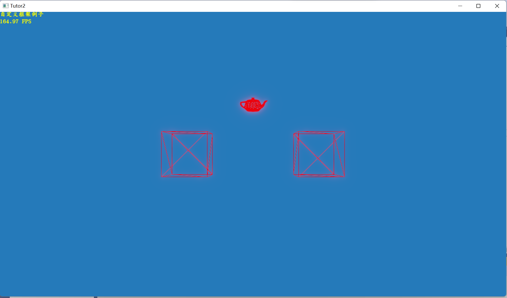

# 003-Tutor2 渲染几何体数据

Tutor2将尝试使用三种不同的方法来渲染几何体：

- 使用预设的辅助对象类
- 从文件读取
- 在程序中使用顶点和索引数组来进行构建。

头文件和框架类的定义：

```cpp
//http://www.klayge.org/wiki/index.php/Tutor2_-_%E6%B8%B2%E6%9F%93%E5%87%A0%E4%BD%95%E4%BD%93%E6%95%B0%E6%8D%AE
#include <KlayGE/KlayGE.hpp>
#include <KlayGE/App3D.hpp>
#include <KlayGE/ResLoader.hpp>
#include <KlayGE/Context.hpp>
#include <KlayGE/Font.hpp>
#include <KlayGE/RenderableHelper.hpp>
#include <KlayGE/RenderEngine.hpp>
#include <KlayGE/RenderFactory.hpp>
#include <KlayGE/FrameBuffer.hpp>
#include <KlayGE/SceneManager.hpp>
#include <KlayGE/SceneNode.hpp>
#include <KlayGE/Mesh.hpp>
#include <KlayGE/CameraController.hpp>
#include <KlayGE/RenderEffect.hpp>
#include <KlayGE/Camera.hpp>

#include <vector>
#include <sstream>

class TutorFramework : public KlayGE::App3DFramework
{
public:
	TutorFramework();
protected:
	virtual void OnCreate();
private:
	virtual void DoUpdateOverlay();
	virtual KlayGE::uint32_t DoUpdate(KlayGE::uint32_t pass);

	KlayGE::TrackballCameraController tbController_;// 使用轨迹球控制器来控制相机，浏览场景
	KlayGE::FontPtr font_;
     // 使用SceneObjectHelper来管理场景中的对象
	KlayGE::SceneNodePtr renderableBox_;
	KlayGE::SceneNodePtr renderableFile_;
	KlayGE::SceneNodePtr renderableMesh_;
	KlayGE::SceneNodePtr renderableAxis_;
};
//从静态网格模型StaticMesh派生得到一个用户类，用于构建来自顶点数据或者文件的几何体对象：
class RenderPolygon : public KlayGE::StaticMesh
{
public:
	explicit RenderPolygon(std::wstring_view name);
	void DoBuildMeshInfo(KlayGE::RenderModel const& model) override;
};
```

cpp实现：

```cpp
void TutorFramework::OnCreate()
{
    font_ = KlayGE::SyncLoadFont("gkai00mp.kfont");
    auto& root_node = KlayGE::Context::Instance().SceneManagerInstance().SceneRootNode();
   
    { // create cube
        /*
        * 首先构建的是预设的辅助几何体，例如三角条带组成的立方体RenderableTriBox，它的输入参数为一个由最小 / 最大坐标
        * 构建的Box对象，以及立方体的颜色。KlayGE中的所有可视物体（即Renderable的派生类，包括RenderableTriBox等）
        * 都必须对应有RenderTechnique，即渲染这个对象的方法——通常从FX文件中读取并获得
        */
        KlayGE::OBBox boxRange(
            KlayGE::MathLib::convert_to_obbox(KlayGE::AABBox(KlayGE::float3(-1.0f, -0.25f, -0.25f), KlayGE::float3(-0.5f, 0.25f, 0.25f))));
        KlayGE::Color boxColor(1.0f, 0.0f, 0.0f, 1.0f);

        /*
        构建一个场景节点，并使用AddToSceneManager将其添加到场景管理器中，从而在窗口中进行渲染
        SceneObjectHelper的传入参数除了辅助几何体的实例以外，还有一个属性参数，它的取值可以为：
        SOA_Cullable：这个对象参与裁减。即，当它位于视锥体之外时，它会被自动排除出渲染队列之外，从而降低渲染负担。
                      如果没有设置这一参数，那么系统将总是渲染这个对象，无论它是否在可见区域之内
        SOA_Overlay：这个对象的渲染始终位于其它对象之前，即覆盖在默认场景之上
        SOA_Moveable：这个对象是可以移动的。此时系统在计算它是否位于视锥体内时，会将GetModelMatrix()考虑在结果当中
        SOA_Unvisible：这个对象是不可见的
        */
        renderableBox_ = KlayGE::MakeSharedPtr<KlayGE::SceneNode>(
            KlayGE::MakeSharedPtr<KlayGE::RenderableComponent>(
                KlayGE::MakeSharedPtr<KlayGE::RenderableTriBox>(boxRange, boxColor)),
            KlayGE::SceneNode::SOA_Cullable);
        root_node.AddChild(renderableBox_);
    }
   
    { // load mesh from file
         /*
        第二个要构建的几何体，从teapot.glb文件中读取（这里的teapot.glb保存在Samples/media/Common目录下）
        LoadModel()的第一个参数为文件名，第二个参数影响了D3D11下的数据访问策略（在OpenGL下无用处），
        第三个参数指定裁剪方式，之后的两个参数指定模型和网格数据对象实例的构建方法。
        注意这里的RenderPolygon就是我们之前自定义的StaticMesh派生类
    */
       KlayGE::RenderModelPtr loadedModel = KlayGE::SyncLoadModel("teapot.glb", KlayGE::EAH_GPU_Read,
            KlayGE::SceneNode::SOA_Cullable, KlayGE::AddToSceneRootHelper,
            KlayGE::CreateModelFactory<KlayGE::RenderModel>, KlayGE::CreateMeshFactory<RenderPolygon>);

        renderableFile_ = loadedModel->RootNode();
        renderableFile_->TransformToParent(KlayGE::MathLib::translation(0.0f, 0.5f, 0.0f));
    }
  
   
    { // custom mesh
        // 定义一串顶点数据，以及用户绘制这些顶点所需的图元和索引数据
        // 这里我们将试图通过8个顶点来绘制一个完整的立方体
        std::vector<KlayGE::float3> vertices;
        vertices.emplace_back(0.5f, -0.25f, 0.25f);
        vertices.emplace_back(1.0f, -0.25f, 0.25f);
        vertices.emplace_back(1.0f, -0.25f, -0.25f);
        vertices.emplace_back(0.5f, -0.25f, -0.25f);
        vertices.emplace_back(0.5f, 0.25f, 0.25f);
        vertices.emplace_back(1.0f, 0.25f, 0.25f);
        vertices.emplace_back(1.0f, 0.25f, -0.25f);
        vertices.emplace_back(0.5f, 0.25f, -0.25f);

        // 首先需要构建一个几何体模型RenderModel，它是所有StaticMesh，也就是静态网格的载体。一个RenderModel可以包含
        // 一个或多个网格对象，每个网格对象都有自己的MaterialID（材质ID），RenderTechnique等属性
        KlayGE::RenderModelPtr model = KlayGE::MakeSharedPtr<KlayGE::RenderModel>(L"model", KlayGE::SceneNode::SOA_Cullable);
        std::vector<KlayGE::StaticMeshPtr> meshes(2);
        std::vector<KlayGE::uint16_t> indices1;
        std::vector<KlayGE::uint16_t> indices2;

        indices1.push_back(0); indices1.push_back(4); indices1.push_back(1); indices1.push_back(5);
        indices1.push_back(2); indices1.push_back(6); indices1.push_back(3); indices1.push_back(7);
        indices1.push_back(0); indices1.push_back(4);;

        // 生成立方体的侧面网格
        meshes[0] = KlayGE::MakeSharedPtr<RenderPolygon>(L"side_mesh");
        meshes[0]->NumLods(1);
        // 将顶点数据的地址和大小传递给网格对象，并指定元素类型，以及D3D11下的数据访问策略
       // 这里的元素类型vertex_element由三个参数组成：
       // 第一个VEU_Position即顶点属性类型，除了顶点坐标之外，还可以为法线VEU_Normal，纹理坐标VEU_TextureCoord等等
       // 第二个参数为索引值，对于纹理坐标属性，它表示该纹理坐标对应的纹理通道
       // 第三个参数表示数据的类型，例如EF_GR32F（float2），EF_BGR32F（float3），EF_ABGR32F（float4）等

        meshes[0]->AddVertexStream(0,&vertices[0],static_cast<KlayGE::uint32_t>(sizeof(vertices[0])*vertices.size()),
            KlayGE::VertexElement(KlayGE::VEU_Position, 0, KlayGE::EF_BGR32F), KlayGE::EAH_GPU_Read);

        // 将索引数据的地址和大小传递给网格对象，此外还有索引数据的类型（EF_R16UI表示16位无符号整数）和数据访问策略
        meshes[0]->AddIndexStream(0, &indices1[0], static_cast<KlayGE::uint32_t>(sizeof(indices1[0]) * indices1.size()),
            KlayGE::EF_R16UI, KlayGE::EAH_GPU_Read);

        // 设置图元的绘制方式，这里我们设置立方体侧面采取三角条带化的方法进行表达
        meshes[0]->GetRenderLayout().TopologyType(KlayGE::RenderLayout::TT_TriangleStrip);
        meshes[0]->PosBound(KlayGE::AABBox(KlayGE::float3(-1, -1, -1), KlayGE::float3(1, 1, 1)));

        indices2.push_back(0); indices2.push_back(1); indices2.push_back(2);
        indices2.push_back(0); indices2.push_back(2); indices2.push_back(3);
        indices2.push_back(7); indices2.push_back(6); indices2.push_back(5);
        indices2.push_back(7); indices2.push_back(5); indices2.push_back(4);

        // 底部和顶部网格
        meshes[1] = KlayGE::MakeSharedPtr<RenderPolygon>(L"cap_mesh");
        meshes[1]->NumLods(1);
        meshes[1]->AddVertexStream(0, &vertices[0], static_cast<KlayGE::uint32_t>(sizeof(vertices[0]) * vertices.size()),
            KlayGE::VertexElement(KlayGE::VEU_Position, 0, KlayGE::EF_BGR32F), KlayGE::EAH_GPU_Read);
        meshes[1]->AddIndexStream(0, &indices2[0], static_cast<KlayGE::uint32_t>(sizeof(indices2[0]) * indices2.size()),
            KlayGE::EF_R16UI, KlayGE::EAH_GPU_Read);
        meshes[1]->GetRenderLayout().TopologyType(KlayGE::RenderLayout::TT_TriangleList);
        meshes[1]->PosBound(KlayGE::AABBox(KlayGE::float3(-1, -1, -1), KlayGE::float3(1, 1, 1)));
        
        for (size_t i = 0; i < meshes.size(); ++i)
        {
            meshes[i]->BuildMeshInfo(*model);
        }
        // 将所有的网格对象传递给RenderModel几何模型
        model->AssignMeshes(meshes.begin(), meshes.end());
        model->BuildModelInfo();
        renderableMesh_ = model->RootNode();
      
        //将几何模型传递给场景对象，加入到场景当中
        for (size_t i = 0; i < meshes.size(); ++i)
        {
            renderableMesh_->AddComponent(KlayGE::MakeSharedPtr<KlayGE::RenderableComponent>(meshes[i]));
        }
       root_node.AddChild(renderableMesh_);
    }
    // set camera lookAt
    this->LookAt(KlayGE::float3(0, 0, -4.0f), KlayGE::float3(0, 0, 0));
    this->Proj(0.1f, 20.0f);

    tbController_.AttachCamera(this->ActiveCamera());
    tbController_.Scalers(0.01f, 0.05f);
}
```

预览图：



源码地址：https://github.com/longlongwaytogo/Learning.test/tree/master/GFX/KlayGE/KlayGELearning/examples/Tutor2

[KlayGE学习主目录](https://blog.csdn.net/kasteluo/article/details/130200334)