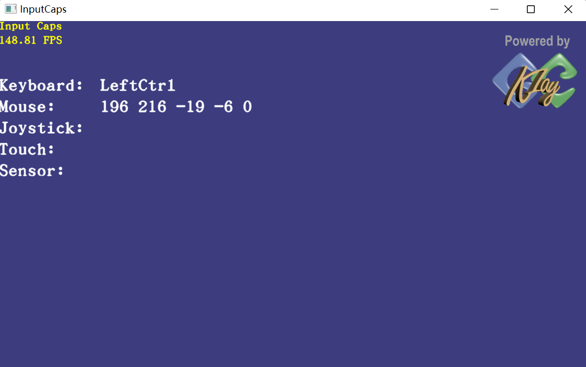

# KlayGE-004-InputCaps 例子分析

InputCaps处理外部输入的事件

该例子主要由两部分内容：

- 外部输入事件获取

​		可以处理keyboard、mouse、joystick、touch、sensor的输入事件

- 显示一个ui图标按钮

## Input

定义监听事件类型：

```cpp
KlayGE::InputActionDefine actions[] =
	{
		InputActionDefine(KeyboardMsg, KS_AnyKey),

		InputActionDefine(MouseMsg, MS_X),
		InputActionDefine(MouseMsg, MS_Y),
		InputActionDefine(MouseMsg, MS_Z),
		InputActionDefine(MouseMsg, MS_AnyButton),

		InputActionDefine(JoystickMsg, JS_LeftThumbX),
		InputActionDefine(JoystickMsg, JS_LeftThumbY),
		InputActionDefine(JoystickMsg, JS_LeftThumbZ),
		InputActionDefine(JoystickMsg, JS_RightThumbX),
		InputActionDefine(JoystickMsg, JS_RightThumbY),
		InputActionDefine(JoystickMsg, JS_RightThumbZ),
		InputActionDefine(JoystickMsg, JS_LeftTrigger),
		InputActionDefine(JoystickMsg, JS_RightTrigger),
		InputActionDefine(JoystickMsg, JS_AnyButton),

		InputActionDefine(TouchMsg, TS_Pan),
		InputActionDefine(TouchMsg, TS_Tap),
		InputActionDefine(TouchMsg, TS_Press),
		InputActionDefine(TouchMsg, TS_PressAndTap),
		InputActionDefine(TouchMsg, TS_Zoom),
		InputActionDefine(TouchMsg, TS_Rotate),
		InputActionDefine(TouchMsg, TS_Flick),
		InputActionDefine(TouchMsg, TS_Wheel),
		InputActionDefine(TouchMsg, TS_AnyTouch),

		InputActionDefine(SensorMsg, SS_AnySensing),

		InputActionDefine(Exit, KS_Escape)
	};
}

```


在OnCreate中绑定事件监听

```cpp
KlayGE::InputEngine& inputEngine = KlayGE::Context::Instance().InputFactoryInstance().InputEngineInstance();
	KlayGE::InputActionMap actionMap;
	actionMap.AddActions(actions, actions + std::size(actions));
	action_handler_t input_handler = MakeSharedPtr<input_signal>();
	 input_handler->Connect(
		[this](InputEngine const& sender, InputAction const& action)
		{
			this->InputHandler(sender, action);
		});
	inputEngine.ActionMap(actionMap, input_handler); 

	// 获取joystic_设备
	for (size_t i = 0; i < inputEngine.NumDevices(); ++i)
	{
		auto const& device = inputEngine.Device(i);
		if (device->Type() == InputEngine::IDT_Joystick)
		{
			joystick_ = checked_pointer_cast<InputJoystick>(device);
		}
	}
```

主要的消息处理函数InputHandler实现：

```cpp
void InputCaps::InputHandler(KlayGE::InputEngine const& sender, KlayGE::InputAction const& action)
{
	switch (action.first)
	{
		case KeyboardMsg:
		{
			key_str_.clear();
			InputKeyboardActionParamPtr param = checked_pointer_cast<InputKeyboardActionParam>(action.second);
			for (uint32_t i = 0; i < 0xEF; ++i)
			{
				if (param->buttons_state[i])
				{
					key_str_ += key_name[i] + L' ';
				}
			}
		}
		break;

		case MouseMsg:
		{
			InputMouseActionParamPtr param = checked_pointer_cast<InputMouseActionParam>(action.second);
			std::wostringstream stream;
			stream << param->abs_coord.x() << ' ' << param->abs_coord.y() << ' ';
			stream << param->move_vec.x() << ' ' << param->move_vec.y() << ' ' << param->wheel_delta << ' ';
			for (uint32_t i = 0; i < 8; ++i)
			{
				if (param->buttons_state & (1UL << i))
				{
					stream << "button" << i << L' ';
				}
			}
			mouse_str_ = stream.str();
		}
		break;

		case JoystickMsg:
		{
			InputJoystickActionParamPtr param = checked_pointer_cast<InputJoystickActionParam>(action.second);
			std::wostringstream stream;
			stream << param->thumbs[0].x() << ' ' << param->thumbs[0].y() << ' ' << param->thumbs[0].z() << ' ';
			stream << param->thumbs[1].x() << ' ' << param->thumbs[1].y() << ' ' << param->thumbs[1].z() << ' ';
			stream << param->triggers[0] << ' ' << param->triggers[1] << ' ';
			for (uint32_t i = 0; i < 16; ++i)
			{
				if (param->buttons_state & (1UL << i))
				{
					stream << "button" << i << L' ';
				}
			}
			joystick_str_ = stream.str();

			if (joystick_)
			{
				for (uint32_t i = 0; (i < joystick_->NumVibrationMotors()) && (i < 2); ++i)
				{
					joystick_->VibrationMotorSpeed(i, param->triggers[i]);
				}
			}
		}
		break;

		case TouchMsg:
		{
			InputTouchActionParamPtr param = checked_pointer_cast<InputTouchActionParam>(action.second);
			std::wostringstream stream;
			stream << touch_name[param->gesture - 0x300] << ' ';
			if (param->gesture != TS_None)
			{
				stream << "center " << param->center.x() << ' ' << param->center.y() << ' ';
				switch (param->gesture)
				{
				case TS_Pan:
				case TS_Tap:
				case TS_Flick:
					stream << "move " << param->move_vec.x() << ' ' << param->move_vec.y() << ' ';
					break;

				case TS_Zoom:
					stream << "factor " << param->zoom << ' ';
					break;

				case TS_Rotate:
					stream << "angle " << param->rotate_angle << ' ';
					break;

				default:
					break;
				}
			}
			if (param->wheel_delta != 0)
			{
				stream << "Wheel " << param->wheel_delta << ' ';
			}
			for (uint32_t i = 0; i < 16; ++i)
			{
				if (param->touches_down & (1UL << i))
				{
					stream << "Touch" << i << L" Down ";
				}
				if (param->touches_up & (1UL << i))
				{
					stream << "Touch" << i << L" Up ";
				}
			}
			touch_str_ = stream.str();
		}
		break;

		case SensorMsg:
		{
			InputSensorActionParamPtr param = checked_pointer_cast<InputSensorActionParam>(action.second);
			std::wostringstream stream;
			stream << "Lat: " << param->latitude << "  Lng: " << param->longitude;
			stream << " Orientation: " << param->orientation_quat.x() << ' ' << param->orientation_quat.y()
				<< ' ' << param->orientation_quat.z() << ' ' << param->orientation_quat.w();
			sensor_str_ = stream.str();
		}
		break;

	case Exit:
		this->Quit();
		break;
	}
}
```


## UI

ui使用内置的ui解析脚本：uiml格式文件,从外部获取一个特定尺寸的图片作为按钮显示在指定位置


```xml
<?xml version='1.0' encoding='utf-8' standalone='no'?>
<ui>
	<dialog id="Logo" caption="Logo" x="-128" y="0" align_x="right" align_y="top" width="128" height="128" show_caption="false" opacity="true" bg_color_a="0">
		<control type="tex_button" id="LogoButton" texture="powered_by_klayge.dds" x="0" y="0" width="128" height="128" is_default="0"/>
	</dialog>
</ui>
```

在OnCreate函数中加载ui资源
```CPP
KlayGE::UIManager::Instance().Load(*KlayGE::ResLoader::Instance().Open("InputCaps.uiml"));
```

在DoUpdateOverlay函数中渲染

```cpp
	KlayGE::UIManager::Instance().Render();
```

在Onsize时，更新：

```cpp
KlayGE::UIManager::Instance().SettleCtrls();
```

## 编写本例子遇到的坑

以下类无法找到，link失败：

```cmd
1>InputCaps.obj : error LNK2019: 无法解析的外部符号 "__declspec(dllimport) class std::unique_ptr<class KlayGE::Signal::Detail::Mutex,struct std::default_delete<class KlayGE::Signal::Detail::Mutex> > __cdecl KlayGE::Signal::Detail::CreateMutexA(void)" (__imp_?CreateMutexA@Detail@Signal@KlayGE@@YA?AV?$unique_ptr@VMutex@Detail@Signal@KlayGE@@U?$default_delete@VMutex@Detail@Signal@KlayGE@@@std@@@std@@XZ)，函数 "public: __cdecl KlayGE::Signal::Detail::SignalTemplateBase<void __cdecl(class KlayGE::InputEngine const &,struct std::pair<unsigned short,class std::shared_ptr<struct KlayGE::InputActionParam> > const &),struct KlayGE::Signal::CombinerDefault<void> >::SignalTemplateBase<void __cdecl(class KlayGE::InputEngine const &,struct std::pair<unsigned short,class std::shared_ptr<struct KlayGE::InputActionParam> > const &),struct KlayGE::Signal::CombinerDefault<void> >(void)" (??0?$SignalTemplateBase@$$A6AXAEBVInputEngine@KlayGE@@AEBU?$pair@GV?$shared_ptr@UInputActionParam@KlayGE@@@std@@@std@@@ZU?$CombinerDefault@X@Signal@2@@Detail@Signal@KlayGE@@QEAA@XZ) 中引用了该符号
1>F:\code\project\test\Learning.test\GFX\KlayGE\KlayGELearning\bin\Debug\InputCaps.exe : fatal error LNK1120: 1 个无法解析的外部命令
```

意思就是找不到这个函数：

```cpp
__declspec(dllimport) class std::unique_ptr<class KlayGE::Signal::Detail::Mutex,struct std::default_delete<class KlayGE::Signal::Detail::Mutex> > __cdecl KlayGE::Signal::Detail::CreateMutexA(void)
```

在KlayGE_Core_vc142.dll中，只找到了这个

```CPP
class std::unique_ptr<class KlayGE::Signal::Detail::Mutex,struct std::default_delete<class KlayGE::Signal::Detail::Mutex> > __cdecl KlayGE::Signal::Detail::CreateMutexW(void)
    
```

很明显，CreateMutex是windows kernel32中的api函数，但KlayGE却导出了一个同名的函数，导致函数签名错误。KlayGE默认使用unicode字符集，我的项目未设置，使用了多字节，结果就成了CreateMutexA。

最终的解决办法 

```cmake
ADD_DEFINITIONS(-DUNICODE -D_UNICODE)
```

**但是，最好不要让自己的函数名称和常用库的API同名，这里出现冲突也和window的unicode使用宏定义有很大原因，如下：**

```
#ifdef UNICODE
#define CreateMutex  CreateMutexW
#else
#define CreateMutex  CreateMutexA
#endif // !UNICODE
```

## 运行效果

 


[源码](https://github.com/longlongwaytogo/Learning.test/tree/master/GFX/KlayGE/KlayGELearning/examples/InputCaps)

[KlayGE学习主目录](https://blog.csdn.net/kasteluo/article/details/130200334)
