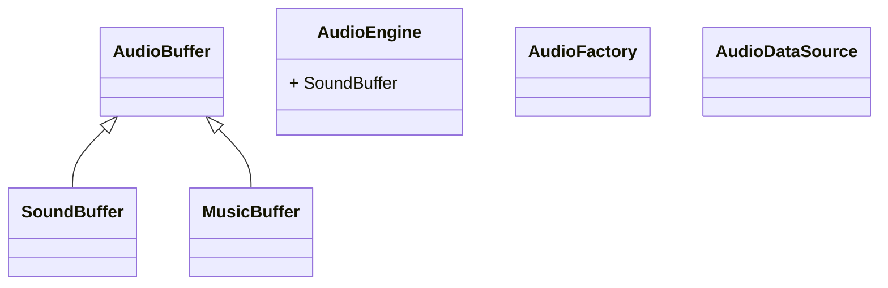

# 004- KlayGE_Engine_Core

## 一、KlayGE引擎中的core模块包含以下部分

- App Layer
- Audio System
- Base
- Input System
- Network System
- Packing System
- Rendering System
- Scene Management
- Script System
- Show System
- UI System


## 二、App Layer 应用层

**Klayge支持多个平台运行：**

- windows desktop

- windows store

- linux

- android

- ios/Darwin

  

**注：**

通俗的来讲，Apple现在的主要操作系统，无论是macOS、iOS还是iPadOS，甚至是HomePod和Apple TV（TvOS）都是建立在Darwin的基础上

**主要类**：

- App3DFramework： 框架类基类，配合window类，处理不同平台的基础程序框架

```cpp
// 一个用于创建3D应用程序框架的基类。建立一个3D应用程序需要继承这个类，
//			然后重载以下函数:
//
//			OnCreate()				- Called when the app is creating.
//			OnDestroy()				- Called when the app is destroying.
//			OnSuspend()				- Called when the app is suspending
//			OnResume()				- Called when the app is resuming.
//			DoUpdate()				- 刷新场景
//			DoUpdateOverlay()		- 刷新Overlay物体
////////////////////////////////////////////////////////////////////////////////
class KLAYGE_CORE_API App3DFramework : boost::noncopyable
```

- Window类，窗口管理,封装不同平台的native窗口句柄操作

```cpp
class KLAYGE_CORE_API Window final : boost::noncopyable
```

每个平台的window实现版本，在不同的文件中：

- WindowWin.cpp
- WindowWinStore.cpp
- WindowLinux.cpp
- WindowIOS.mm
- WindowDarwin.cpp
- WindowAndroid.cpp

# 三、Audio System 音频系统

Audio System 定义有关声音部分的接口，主要类：

- AudioBuffer
- SoundBuffer
- MusicBuffer
- AudioEngine
- AudioDataSource
- AudioFactory



# 四、Input System 输入系统

# 五、Network System 网络系统

# 六、Packing System 打包系统

# 七、Rendering System 渲染系统


## Effect Files

Effect FIles: 是程序加载的一组shader脚本的xml配置文件，主要有：

- 2D.fxml
- BilateralBlur.fxml
- Blitter.fxml
- Blitter.kfx
- Blur.fxml
- Blur.kfx
- Bone.fxml
- CameraProxy.fxml
- CascadedShadow.fxml
- CascadedShadow.kfx
- ClusteredDeferredRendering
- ClusteredDeferredRendering
- ColorGrading.fxml
- ColorSpaceUtil.fxml
- Copy.fxml
- Copy.kfx
- Copy2LightBuffer.fxml
- Copy2LightBuffer.kfx
- Decal.fxml
- DeferredRendering.fxml
- DeferredRenderingDebug.fxm
- DeferredRenderingDebug.kfx
- DeferredRenderingUtil.fxml
- Depth.fxml
- Depth.kfx
- DepthOfField.fxml
- DepthOfField.kfx
- FFT.fxml
- Fog.fxml
- Font.fxml
- Font.kfx
- FXAA.fxml
- GammaCorrection.fxml
- GBuffer+GBufferSSR.kfx
- GBuffer.fxml
- GBuffer.kfx
- GBufferFlatTess.fxml
- GBufferLine.fxml
- GBufferParallaxOcclusionMa
- GBufferSkinning.fxml
- GBufferSmoothTess.fxml
- GBufferSSR.fxml
- GBufferSSS.fxml
- GBufferTwoSided.fxml
- HDRDisplay.fxml
- Imposter.fxml
- InfTerrain.fxml
- JudaTexture.fxml
- LensEffects.fxml
- LensEffects.kfx
- LensFlare.fxml
- LightIndexedDeferredRender
- Lighting.fxml
- LightShaft.fxml
- LightSourceProxy.fxml
- LightSourceProxy.kfx
- list.txt
- Material.fxml
- Mesh.fxml
- Mipmapper.fxml
- Mipmapper.kfx
- ModelCamera.fxml
- MotionBlur.fxml
- MotionBlur.kfx
- MultiRes.fxml
- MultiRes.kfx
- Noise.fxml
- Particle.fxml
- Particle.kfx
- PointSprite.fxml
- PostProcess.fxml
- PostToneMapping.fxml
- PostToneMapping.kfx
- PPR.fxml
- PPR.kfx
- PredefinedCBuffers.fxml
- PredefinedCBuffers.kfx
- PrefixSum.fxml
- Quaternion.fxml
- RenderableHelper.fxml
- RenderableHelper.kfx
- Resizer.fxml
- Resizer.kfx
- RSM2VPLs.fxml
- RSM2VPLs.kfx
- SAT.fxml
- SkyBox.fxml
- SkyBox.kfx
- SMAA.fxml
- SMAA.kfx
- Sort.fxml
- SSGI.fxml
- SSR.fxml
- SSR.kfx
- SSS.fxml
- SSS.kfx
- SSVO.fxml
- SSVO.kfx
- Stereoscopic.fxml
- SumLum.fxml
- SumLum.kfx
- TAA.fxml
- TAA.kfx
- Tessellation.fxml
- ToneMapping.fxml
- ToneMapping.kfx
- UI.fxml
- UI.kfx
- util.fxml
- VarianceDepthMap.fxml
- VarianceDepthMap.kfx
- VPLsLighting.fxml
- VPLsLighting.kfx

## 主要类：

- Blitter.hpp
- Camera.hpp
- CameraController.hpp
- CascadedShadowLayer.hpp
- DeferredRenderingLayer.hpp
- DepthOfField.hpp
- DistanceField.hpp
- ElementFormat.hpp
- FFT.hpp
- Font.hpp
- FrameBuffer.hpp
- GraphicsBuffer.hpp
- HDRPostProcess.hpp
- HeightMap.hpp
- Imposterr.hpp
- IndirectLightingLayer.hpp
- InfTerrain.hpp
- JudaTexture.hpp
- Lensfare.hpp
- Light.hpp
- LightShaft.hpp
- Mesh.hpp
- Mipmapper.hpp
- MotionBlur.hpp
- MultResLayer.hpp
- ParticleSystem.hpp
- PostProcess.hpp
- PPRPostProcess.hpp
- Query.hpp
- Renderable.hpp
- RenderableHelper.hpp
- RenderDeviceCaps.hpp
- RendedrEffect.hpp
- RenderEngine.hpp
- RenderFactory.hpp
- RenderLayout.hpp
- RenderMaterial.hpp
- RenderSetttings.hpp
- RenderStateObject.hpp
- RenderView.hpp
- SATPostProcess.hpp
- ShaderObject.hpp
- SkyBox.hpp
- SSGIPostProcess.hpp
- TexCompression.hpp
- TexCompressionBC.hpp
- TexCompresssionETC.hpp
- Texture.hpp
- TransientBuffer.hpp
- ViewPort.hpp

## Post Processors

- CascadeShadow.ppml

- ColorGrading.ppmml

- Copy.ppml

- Copy2LightBuffer.ppml

- Depth.ppml

- DepthOfField.ppml

- FTT.ppml

- Fog.ppml

- FXAA.ppml

- GammaCorrection.ppml

- HDRDisplay.ppml

- LensEffects.ppml

- LightShaft.ppml

- MotionBlur.ppml

- MultiRes.ppml

- PostToneMapping.ppml

- Resizer.ppml

- RSM2VPLs.ppml

- SAT.ppml

- SMAA.ppml

- Sort.ppml

- Stereoscopic.ppml

- TAA.ppml

- ToneMapping.ppml

- Transucentcy.ppml

- VarianceDepthMap.ppml

  


# 八、Scene Management 场景管理

# 九、Script System 脚本系统

# 十、Show System 显示系统

# 十一、UI System 界面系统

# 十二、Base 基础


