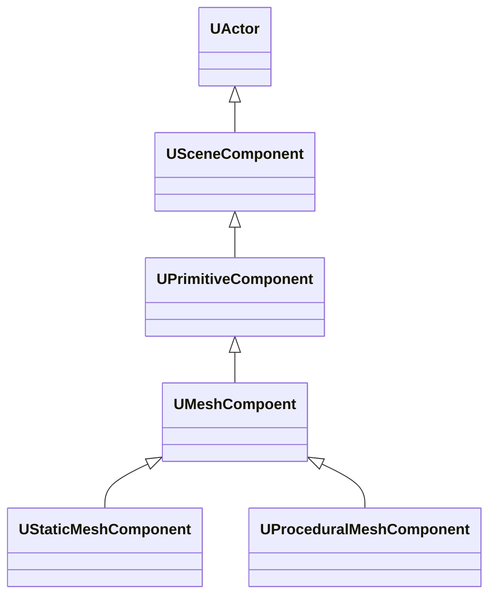
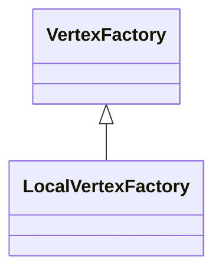

# Mesh

[【UE4.26】浅析4种Mesh生成组件 - 知乎 (zhihu.com)](https://zhuanlan.zhihu.com/p/366684356)

- **RuntimeMeshComponent**
- **ProcedualMeshComponent**
- **StaticMeshComponent**
- **SimpleDynamicMeshComponent**

### **ProcedualMeshComponent**

UE自带的组件，数据结构会储存在FProcMeshSection中，而渲染是通过FProceduralMeshSceneProxy进行。

PMC最多支持4个UV通道。

**StaticMeshComponent（SMC）：**

SMC也是UE自带的组件，它的数据结构并不在组件当中。而是在组件引用的UStaticMesh中。它真正的数据结构格式是FMeshDescription。在UE4.25之前并不支持在运行时更新Mesh，在UE4.25时添加了UStaticMesh::BuildFromMeshDecriptions()这个接口。所以可以在运行时去改变FMeshDescription中的内容从而实现运行时改变Mesh。

它的渲染是通过FPrimitiveSceneProxy进行。

SMC支持7个UV通道

**RuntimeMeshComponent（RMC）：**

第三方组件，支持LOD，并且支持8个UV通道。它的数据结构也不是直接储存在组件当中。储存在URuntimeMeshProviderStatic的FRuntimeMeshRenderableMeshData中的。

RMC会将准备好的数据直接塞入URuntimeMeshComponentEngineSubsystem中的渲染队列MeshesToUpdate当中。当创建完FRuntimeMeshComponentSceneProxy后。渲染线程就会去获取这个队列中的数据，完成Mesh的更新。

**SimpleDynamicMeshComponent（SDMC）：**

SDMC的数据结构就是FDynamicMesh3，所以当它使用几何处理插件时效率也是最高的。并不像其他的组件还要对FDynamicMesh3中的数据进行拆分和重组，这里只需要一个拷贝即可完成SDMC的数据组建。

它的渲染是通过一个RenderStateDirty布尔值进行的。当需要更新Mesh时，会去设置这个布尔值为true。等到渲染线程时会去创建FSimpleDynamicMeshSceneProxy，然后在进行渲染。

**RMC与PMC在移动端的效率测试：**

根据RMC作者的说法，RMC相比较PMC会有50%-90%更少的内存使用，30%-100%更少的CPU时间。下面就简单的做一个测试。

首先还是利用关卡蓝图来创建36个动画Mesh（每帧更新的Mesh），这样就可以免去手动去放置这些蓝图。在关卡蓝图中就可以切换测试的是哪种Component。

在真机上也能得到类似的结果。所以对比可以发现RMC无论从运行效率和内存上都优于PMC。

**最后还有一些问题：**

1. 在本文中的第一个场景（也就是演示4种墙体破坏效果的场景），一旦含有StaticMesh组件就无法切换到移动管线，否则会有一个顶点工厂无法初始化而导致报错，当然可以用一些trick让其不报错误，但是这个毕竟治标不治本。暂时还不清楚是这个是组件的问题还是引擎自身的问题。

2. Geometry Processing Plugin暂时无法打包成安卓包，打包时会蹦出链接错误，如果真的想运用这个插件到移动端上，这一点还需要深入研究，并尝试去修改插件的源码。

3. 在文章提到的第二个场景（实时生成动画网格场景），如果使用RMC实现的动画网格。在安卓机上会出现闪烁的现象，而且这种现象只会在跑满帧和帧数极低的情况下出现。如果手动限制帧数的话闪烁现象会消失。虽然RMC从各个方面都优于PMC，但是如果想在实际项目中用到RMC的话，这一点确实是一个致命的问题。如果仅仅是生成静态网格，那么还是推荐使用RMC。

4. 在使用Geometry Processing Plugin对PMC和RMC进行处理的时候，模型可能会出现漏缝的现象（这个不是很确定，后来我就没有再复现出来）。

   

# CustomMesh

link:

[创建虚幻自定义Mesh组件 | Part 0: 介绍 - 知乎 (zhihu.com)](https://zhuanlan.zhihu.com/p/361268199)

**自定以Mesh Component使用场景**

创建自定义的Component，可以完全控制整个Mesh的渲染过程。根据你的目标，你能做出自己的优化方案，去实现内置Mesh Component 不能实现的功能。

- Vertex Factories
- Vertex Factory实现
- Mesh Component 的Scene Proxy
- 自定义mesh组件

FRHIResource： 是RHI Resource的基本类型，他可以是顶点缓冲（vertex buffers),索引缓冲（index buffers），混合状态（blend states）等等。图形API任意资源都有一个 RHI 封装。

**[FRenderResource](https://link.zhihu.com/?target=https%3A//docs.unrealengine.com/en-US/API/Runtime/RenderCore/FRenderResource/index.html)** 定义了渲染资源的通用行为模式。这些定义都在渲染模块中，他们创建和封装了**FRHIResources**。我们可以直接创建和交互RenderResource，与此同时，他RenderResource也为我们创建了所需的**FRHIResources。** 这就是为什么这个接口包括一些初始化和释放RHI Resource的方法**（ InitRHI() , ReleaseRHI()等等）**

**Vertex Factories作用：**

Vertex Factory 主要的职责特定类型的mesh的顶点信息从CPU传递到GPU，顶点信息将被Vertex Shader 所使用。如果你有图形学背景，你可能知道在图形API就是创建不同的资源然后将它们绑定到渲染状态中。

- 创建和绑定顶点缓冲
- 创建和绑定输入布局（input Layout）
- 创建和绑定VertexShader

