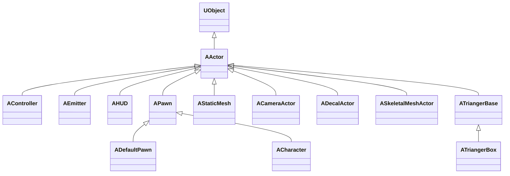
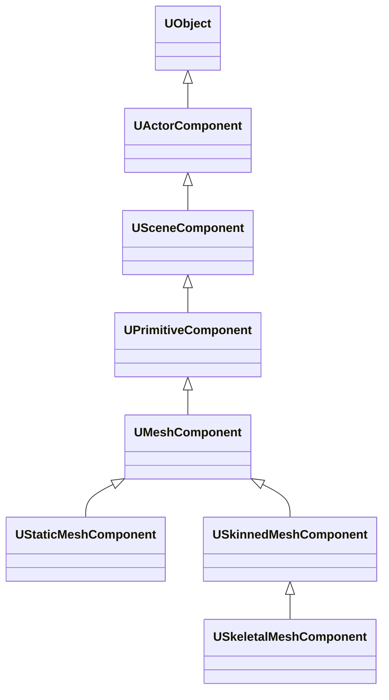
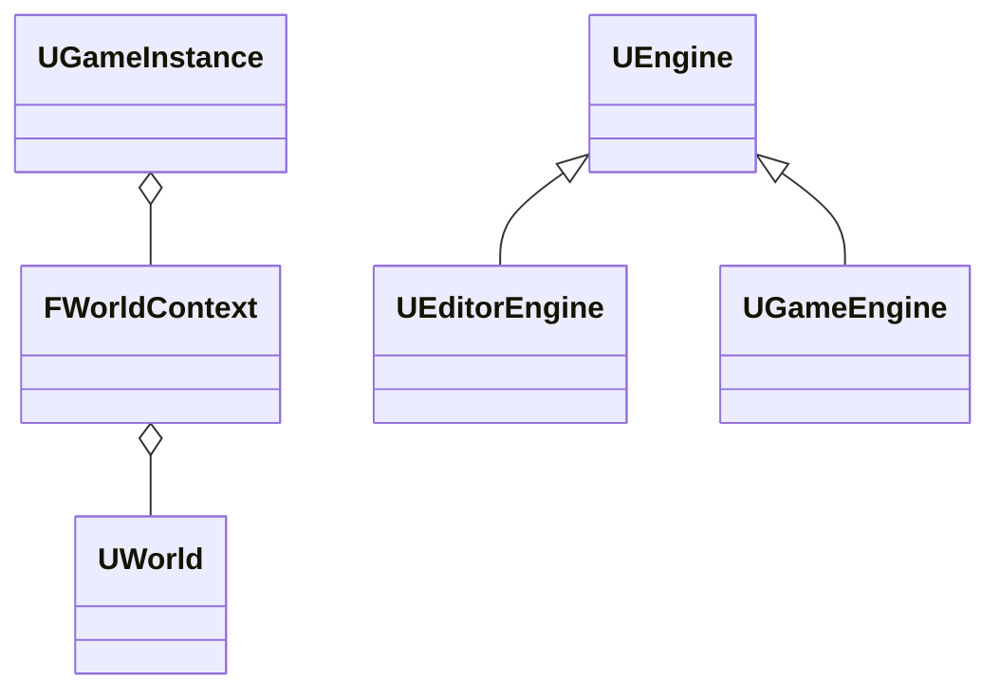

```mermaid
classDiagram
class UObject
UObject <|-- AActor
AActor <|-- AController
AActor <|-- AEmitter
AActor <|-- AHUD
AActor <|-- APawn
AActor <|-- AStaticMesh
AActor <|-- ACameraActor
AActor <|-- ADecalActor
AActor <|-- ASkeletalMeshActor
AActor <|-- ATriangerBase
ATriangerBase <|-- ATriangerBox
APawn <|-- ADefaultPawn
APawn <|-- ACharacter

```

```mermaid
classDiagram
class UObject
UObject <|-- UActorComponent
UActorComponent<|--USceneComponent
USceneComponent<|--UPrimitiveComponent
UPrimitiveComponent <|-- UMeshComponent
UMeshComponent <|-- UStaticMeshComponent
UMeshComponent <|-- USkinnedMeshComponent
USkinnedMeshComponent <|-- USkeletalMeshComponent
```

```mermaid
classDiagram
FWorldContext o-- UWorld
 UGameInstance o-- FWorldContext
 UEngine <|-- UEditorEngine
 UEngine <|-- UGameEngine
```

