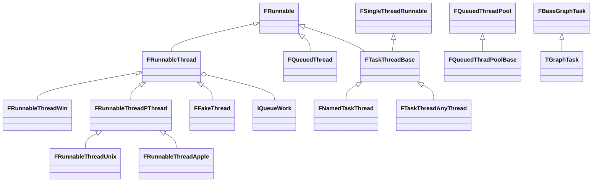

# 多线程

- FRunnable

- FSingleThreadRunnable: 

  Interface for ticking runnables when there's only one thread available and multithreading is disabled.

- FRunnableThread

```mermaid
classDiagram

FRunnable <|-- FRunnableThread
FRunnableThread <|-- FRunnableThreadWin
FRunnableThread <|-- FRunnableThreadPThread
FRunnableThread <|-- FFakeThread
FRunnableThreadPThread <|--FRunnableThreadUnix
FRunnableThreadPThread <|--FRunnableThreadApple
FRunnable <|--FQueuedThread
FRunnableThread o-- IQueueWork
FRunnable <|-- FTaskThreadBase
FSingleThreadRunnable <|-- FTaskThreadBase
FQueuedThreadPool <|-- FQueuedThradPoolBase
FBaseGraphTask <|-- TGraphTask
FTaskThreadBase <|-- FNamedTaskThread
FTaskThreadBase <|-- FTaskThreadAnyThread
```

