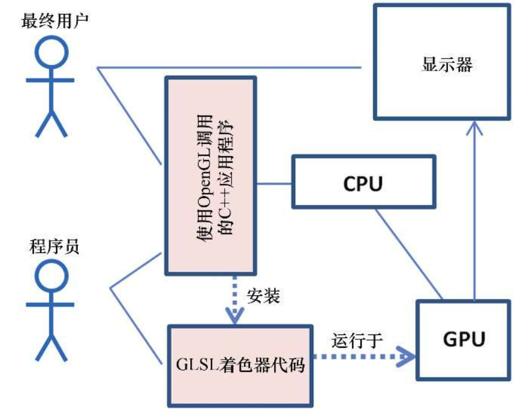

# 《计算机图形学编程》(使用OpenGL和C++)
著： 

- [美] V.斯科特.戈登	V.Scott.Gordon
- [美] 约翰.克莱维吉 John.Clevenger

译：

- 魏广程
- 沈瞳

## 出版社：
	中国工业出版社	人民邮电出版社

## 1. 本书主要讲什么

	本书主要以OpenGL和C++语言为基础，讲解和演示了图形学基础理论知识，更具实用性和操作性。

## 2. 本书具体讲了哪些内容
本书分14章和3个附录，先后讲到：
- OpenGL图形管线
- 图形编程数学基础
- 管理3D图形数据
- 纹理贴图
- 3D模型
- 光照
- 阴影
- 天空
- 背景
- 增强表面细节
- 参数曲面
- 曲面细分着色器
- 几何着色器
- 噪声纹理
- 3D纹理
- 其他
- 附录包含了window和macox平台的安装、NSight调试工具使用
## 3. 本书编制的目的：
	作为计算机科学专业本科OpenGL 3D图形看成相关课程的教材使用
## 4. 目标读者：
	计算机专业本科在读学生
## 5. 习题
	本书每章配有一定的习题，辅助学生对每章内容进一步理解和学习

## 6. 配套资源
	 原网站的资源已经不可用，后续补充本人收集的资源

## 7. 教师辅助资源
- ppt教学大纲
- 每个讲解详细资料
- 习题答案和源码

## 8. 本书用到的第三方库
- Soil2： 读取和处理纹理文件
- GLFW： 图形窗口管理库
- GLEW： OpenGL扩展库

## 9. 本书提到的其他图书：

- 《OpenGL Subperbile》
- 《OpenGL Proggramming Guide》
- 《OpenGL 4 Shading Language Cookbook》
- 《Interactive Compute Graphics》
- 《Intoduction to 3D Game programming with DirectX 12》

## 10. 作者简介：
	V.斯科特.戈登(V.Scott Gordon)博士，已在加州州立大学担任教授20多年，主要教授高级图形和游戏工程课程
	
	约翰.克莱维吉(John clevenger)博士，拥有超过40年教学经验，教学内容包括高级图形、游戏架构、操作系统、VLSL芯片设计和系统仿真等。


# 第一章 入门简介
- 简单介绍了OpenGL图形库
- 基于OpenGL开发环境以和以来环境进行介绍，主要包括：
	- c++开发环境： Windows平台--visual Studio/MocOS--XCode
	- OpenGL/GLSL(4.3):OpenGL存在多个版本，3.3之后是一个分水岭
	- 图形管理：glut/cpw/Glow/Clui/GLFW
	- 扩展库：GLee/GLLoader/Glew/GL3W/GLAD
	- 数学库： GLM/Eigen/Vmath
	- 纹理管理库：FreeImage/DevIL/GLI/Glraw/SOIL/SOIL2(simple OpenGL image loader)
	- 可选库：Assimp/tinyobjLoader
- 安装和配置
	C++和OpenGL环境开发


# 第二章 OpenGL图形管线

## 1. OpenGL是整合软硬件的多平台2D和3D图形API

### OpenGL
- 软件层提供c的接口调用
- 硬件层提供一个多级图形管线，并提供GLSL语言编程

## 2. OpenGL程序概览



## 3. OpenGL图形管线

- 顶点着色器：对顶点进行操作，主要处理顶点的位置
- 曲面细分着色器：用以生成大量三角形(TCS/TES)
- 几何着色器：以图元(三角形/点/四边形)为单位，可操作图元中的多个顶点，主要用于生成额外图元的能力
- 光栅化： 将3D世界的点、三角形展现到2D平面的显示器上，转化为以像素为单位的阵列(插值处理)
- 片段着色器：用于处理光栅化后的像素，指定像素颜色
- 像素操作：处理隐藏面消隐（HSR/z-buffer)

#  第三章 数学基础
## 1. 3D坐标系
 OpenGL使用右手系,DirectX使用左手系

## 2. 齐次坐标
 - 点的表示(x,y,z,1)
 - 向量(x,y,z,0)
 ## 3. 矩阵
 - 矩阵分为行主序矩阵和列主序矩阵
 - OpenGL使用列主序矩阵，计算乘法执行从左往右
### 3.1 矩阵类型
- 单位矩阵

$$
\begin{bmatrix}
1 & 0 & 0 & 0 \\
0 & 1 & 0 & 0 \\
0 & 0 & 1 & 0 \\
0 & 0 & 0 & 1
\end{bmatrix}
$$

- 转置矩阵:	将矩阵的主对角线翻转，交换矩阵的行索引与列索引

$$
\begin{bmatrix}
A_{00} & A_{01} & A_{02} & A_{03} \\
A_{10} & A_{11} & A_{12} & A_{13} \\
A_{20} & A_{21} & A_{22} & A_{23} \\
A_{30} & A_{31} & A_{32} & A_{33} 
\end{bmatrix} 
= 
\begin{bmatrix}
A_{00} & A_{10} & A_{20} & A_{30} \\
A_{01} & A_{11} & A_{21} & A_{31} \\
A_{02} & A_{12} & A_{22} & A_{32} \\
A_{03} & A_{13} & A_{23} & A_{33} 
\end{bmatrix} ^T
$$
- 逆矩阵： $ A*A^{-1} = E $  或 $ AB=BA=E $

- 正交矩阵：
$$
AA^T=E
$$
即：转置等于其逆的矩阵:
$$
A^T = A^{-1}
$$

 - 矩阵运算
 - 加法
$$
\begin{bmatrix}
	A + a & B + b & C + c & D + d \\
	E + e & F + f & G + g & H + h \\
	I + i & J + j & K + k & L + l \\
	M + m & N + n & O + o & P + p 
\end{bmatrix} = 
\begin{bmatrix} 
A & B & C & D \\
E & F & G & H \\
I & J & K & L \\
M & N & O & P
\end{bmatrix} + 
\begin{bmatrix}
 a & b & c & d \\
 e & f & g & h \\
 i & j & k & l \\
 m & n & o & p 
\end{bmatrix}
$$
 - 乘法
$$
\begin{bmatrix} 
AX & BY & CZ & D \\
EX & FY & GZ & H \\
IX & JY & KZ & L \\
MX & NY & OZ & P
\end{bmatrix}  =
\begin{bmatrix} 
A & B & C & D \\
E & F & G & H \\
I & J & K & L \\
M & N & O & P
\end{bmatrix} 
\times 
\begin{pmatrix}
	X \\
	Y \\
	Z
\end{pmatrix}
$$
- 平移矩阵	
$$
\begin{pmatrix}
	X + T_x \\
	Y + T_y \\
	Z + T_z \\
	 1
\end{pmatrix}  =
\begin{bmatrix}
	1 & 0 & 0 & T_x \\
	0 & 1 & 0 & T_y \\
	0 & 0 & 1 & T_z \\
\end{bmatrix} 
\times
\begin{pmatrix}
	X \\
	Y\\
	Z
\end{pmatrix}	 
$$
   - 缩放矩阵
$$
\begin{bmatrix}
X * S_x \\
Y * S_y \\
Z * S_z
\end{bmatrix}=
\begin{bmatrix}
S_x & 0 & 0 & 0 \\
0 & S_y & 0 & 0 \\
0 & 0 & S_z & 0 \\
0 & 0 & 0 & 1
\end{bmatrix} 
\times
\begin{bmatrix} 
X \\
Y \\
Z \\
1
\end{bmatrix}
$$
   - 右手系转左手系矩阵
$$
\begin{bmatrix}
1 & 0 & 0 & 0 \\
0 & 1 & 0 & 0 \\
0 & 0 & -1 & 0 \\
0 & 0 & 0 & 1 
\end{bmatrix}
$$
- 旋转矩阵
	旋转矩阵的数值很是类似，个人总结了以下规律：
	- 条件： 
		- 右手坐标系，列主序矩阵
		- 旋转方向：从开始轴到目标轴
	- 被旋转的轴所对应的矩阵分量值不变
	- 起始轴向目标轴旋转，目标轴$sin(\theta)$值前加负号
	- 左侧列总为：$cos(\theta),sin(\theta)$组合
	- 右侧列总为:  $sin(\theta),cos(\theta)$组合

- 投影矩阵
	- 透视投影
		
		
		
	- 正交投影
  	
	
	投影矩阵范围中，z方向的范围为[0,1]（opengl投影矩阵z方向为[-1,1]，可以参考opengl编程指南附录部分)
  
   - LookAt矩阵
      
      
  
  # 4. 向量运算
  
- 加减
$$
A\pm B = (u \pm x, v \pm y, w \pm z )
$$
- 点积
$$
A \cdot B = (ux + vy + wz)
$$
- 叉积

$$
A \times B = 
(vz- wy, wx - uz, uy - vx)
$$


# 第四章 管理3D图形数据

## 缓冲区与顶点属性

- 每个顶点数据所关联的相关数据：顶点，法线，颜色，uv等

- 缓冲区类型：VBO、VAO、EBO

  

## 统一变量uniform

uniform变量是cpu向gpu传递数据的一种方式，支持：

- 将变量传递到每个着色器中
- 每个着色器不能修改uniform变量
- 顶点着色和片段着色中的uniform值相同，片段中不会对uniform进行插值

## 顶点属性插值

从顶点传递到片段的数据会进行线性插值

## 模型视图投影变换矩阵

```cpp
gl_Position = gl_ProjectionMatrix * gl_ModelViewMatrix * gl_Vertext;
```


## 3D立方体程序

- createShaderProgram
- readShaderSource
- checkOpenGLError
- printProgramLog
- pringShaderLog

  


## 实例化

glDrawArraysInstanced

gl_InstanceID


## 矩阵栈


##  z冲突

 z-fighting /Depth-fighting

产生原因： 深度缓冲区中值的精度有限

解决方法：

 - 使用合适的近远裁
 - 使用polygonoffset进行偏移处理

## 性能优化
-  尽量减少动态内存空间分配
-  尽量减少动态内存空间分配 
-  背面剔除：glCullFace

# 第五章 纹理贴图

##  opengl相关函数：
- glBindTexture
- glTexParameter
- 着色器中使用纹理采样器：Sampler2D、Sampler3D等

## 滤波方式
- minFilter
- magFilter
## 滤波值：
  - GL_LINEAR
  - GL_NEAREST 
  - ### mipmaping 多级渐远
	- GL_NEAREST_MIPMAP_NEAREST：最近插值
	- GL_LINEAR_MIPMAP_NEARST: 线性插值
	- GL_NEARST_MIPMAP_LINEAR: 双线性插值
	- GL_LINEAR_MAPMAP_LINEAR:三线性插值

## 各向异性
	为解决mipmaping使用过程中，由于视角不同而产生的失真模糊，给出的解决方式	

## 环绕和平铺
- GL_REPEAT
- GL_MIRRORED_REPEAT
- GL_CLAMP_TO_EDGE
- GL_CLAMP_TO_BORDER
##  透视矫正
  noperspective


# 第六章 3D模型

## 1 程序构建模型

### 1.1 构建球体

- 在整个球体上，选择一系列圆形“水平切片”的精度
- 将每个原型切片的圆周若干等分
- 将顶点切分组成三角形
- 根据纹理图像的性质选择纹理坐标
- 对每个顶点计算法线


### 1.2 构建环

- 将一个顶点位于远点的右侧，在XY平面上的圆中，让这个顶点绕Z轴旋转形成“环”
- 将这个环“向外”移动“内半径”那么长距离。
- 围绕Y轴旋转最初的这个环，形成用来构成环面的其他环的顶点


## 2 加载外部模型

**OBJ格式加载**

- vn-顶点法线
-  f-面
- v- 几何（顶点）数据
- vt-纹理


# 第七章 光照

## 光照模型

### ADS模型：

- Ambient reflection:环境光

- Diffuse reflection：漫反射光

- specular reflection：镜面光

  

### 光源

- global Ambient 全局光
- direction light 定向光
- location light 位置光
- spot light 聚光灯

### 位置光源衰减

$$
	attenuation = \frac{1}{\mathbf{K}_c+ \mathbf{K}_{i}*d + \mathbf{K}_{q}*d^{2}} 
$$

### 聚光灯参数


### 光照模型公式

$$
\mathbf{I}_{observed} = \mathbf{I}_{ambient} + \mathbf{I}_{diffuse} + \mathbf{I}_{specular}
$$

**环境光**
$$
\mathbf{I}_{ambient} = \mathbf{Light}_{ambient} * \mathbf{Material}_{ambient}
$$


**漫反射光**
$$
\mathbf{I}_{diffuse} = \mathbf{Light}_{diffuse} * \mathbf{Material}_{diffuse} * cos(\theta)
$$

$$
\mathbf{I}_{diffuse} = \mathbf{Light}_{diffuse} * \mathbf{Material}_{diffuse} * cos(\vec{N} \cdot \vec{L})
$$


**镜面光**
$$
\mathbf{I}_{spec} = \mathbf{Light}_{spec} *\mathbf{Material}_{spec} * max(0,(\mathbf{\vec{R} \cdot \vec{V}})_{n})
$$

**Gouraund着色**

在顶点着色器实现线性插值

**Phong着色**

在片段实现线性插值

### 光照和纹理

```glsl
fragColor = textureColor * (ambient + diffuse) + specluar
```


# 第八章 阴影

## 阴影分类

### 投影阴影：

将物体上的点通过一个变换矩阵，投射到一个平面上


### 阴影体

 找到被物体阴影覆盖的阴影体，通过减少视体与阴影体相交部分的颜色强度实现阴影（蒙版阴影）


- 阴影贴图：（1）将视点以光源位置观察场景，绘制可见物体所生成的一张贴图，该贴图上的物体均为产生阴影的物体；（2）正常渲染场景并使用阴影贴图作为判断依据生成阴影

## 纹理拷贝函数

- glCopyTexImage2D
- glFramebufferTexture

### 范围映射偏移矩阵

$$
Baise = \begin{vmatrix} 0.5 & 0.0 & 0.0 & 0.5 \\
0.0 & 0.5 & 0.0 & 0.5 \\
0.0 & 0.0 & 0.5 & 0.5 \\
0.0 & 0.0 & 0.0 & 1.0 
\end{vmatrix}
$$


## 阴影疮(Shadow acne)

阴影疮的形成是由于深度测试的舍入误差所导致。在阴影贴图中查找深度信息时计算的纹理坐标通常与实际不完全匹配，从而获取到临近像素深度。

阴影疮常用处理方法，使用polygon offset偏移绘制，将阴影贴图向更远处偏移一定距离渲染

## 柔和阴影： 

PCF： 百分比临近滤波（Percentage Closer Filtering)

获取合适的采样点


```glsl
(shadow_coord.x - 1.5, shadow_coord.y + 0.5)
(shadow_coord.x - 1.5, shaodw_coord.y - 1.5)
(shadow_coord.x + 0.5, shaodw_coord.y + 0.5)
(shadow_coord.x + 0.5, shaodw_coord.y - 1.5)
```

